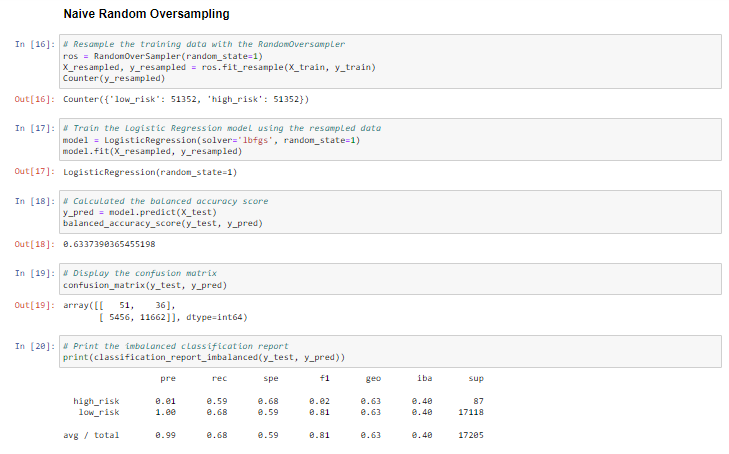
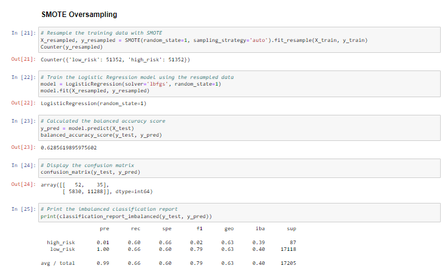
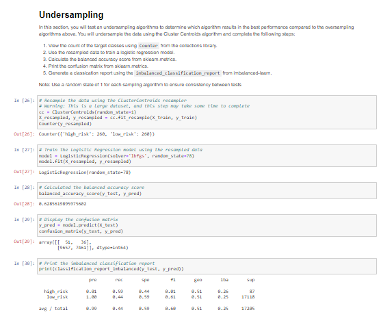
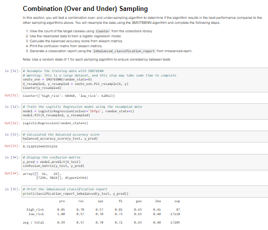
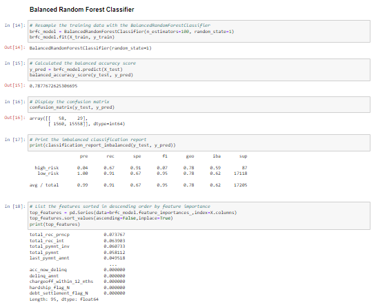
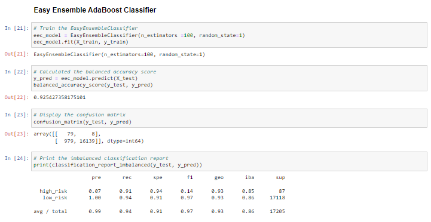

# Credit Risk Analysis

## Overview of Credit Risk Analysis

[Insert Summary Here]
 
### Resources

* Resources:  LoadStats2019.csv
* Software:  Python, imblearn, sci-kit learn, Visual Studio Code, 1.38.1

## Credit Risk Analysis Machine Learning Results

## Machine Learning Model #1:  Niave Random Oversampling

*  Balanced Accuracy Score:  0.63
*  Precision and Recall Score:  0.99 and 0.68

## Machine Learning Model #2:  SMOTE Oversampling

*  Balanced Accuracy Score:  0.63  

*  Precision and Recall Score:  0.99 and 0.66

## Machine Learning Model #3:  Undersampling

*  Balanced Accuracy Score:  0.63

*  Precision and Recall Score:  0.99 and 0.44

## Machine Learning Model #4:  Combination Over and Under Sampling

*  Balanced Accuracy Score:  0.51

*  Precision and Recall Score:  0.99 and 0.57

## Machine Learning Model #5:  Balanced Random Forest Classifier

*  Balanced Accuracy Score:  0.79

*  Precision and Recall Score:  0.99 and 0.91

## Machine Learning Model #6:  Easy Ensemble AdaBoost Classifier

*  Balanced Accuracy Score:  0.93

*  Precision and Recall Score:  0.99 and 0.94

## Summary of Credit Risk Analysis

[Insert Summary Here]

## Credit Risk Analysis Code Snippets

### Deliverable #2:
